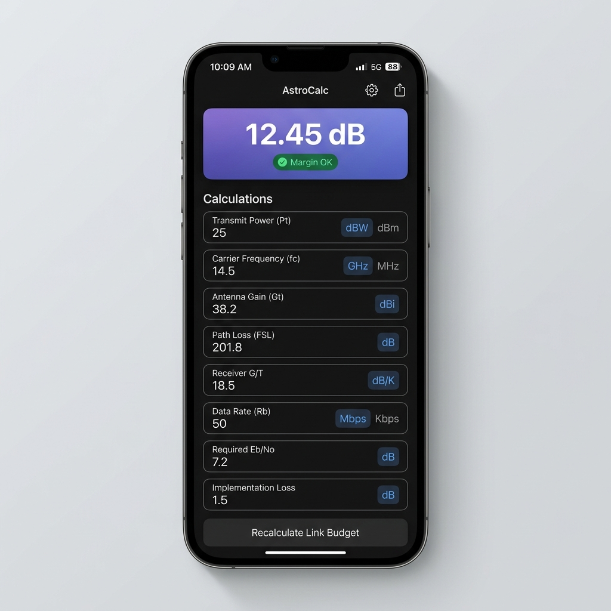

# 遥测计算模块 UI 深度审查与核心设计提案
*(Telemetry Calculator UI Review & Core Design Proposal)*

针对用户反馈的“左右两列布局不和谐”以及“整机视觉风格不协调”的问题，我们进行了深度的自省式审查。

本方案旨在打破现有的“俄式套娃式”卡片嵌套，并引入**“结果看板化、输入表单化、公式抽屉化”**的专业工程设计理念。

---

## 1. 深度再审查：为什么现有 UI 让人感觉“很不和谐”？

通过对 [telemetry_calc_view.dart](../lib/modules/telemetry_calc/telemetry_calc_view.dart) 完整代码的走查，我们发现以下四个深层视觉与交互缺陷是造成“粗糙感”与“不和谐”的根本原因：

### 🚨 盒中盒深渊 (The Over-Boxing Antipattern)
现有界面存在严重的**过度容器化（Over-Boxing）**。在详情页中，我们能数出高达 **5 层** 的嵌套边框与背景：
1. **第一层**：Scaffold 页面背景（灰色/暗色底）。
2. **第二层**：`AppCard`（外层大卡片，圆角 20）。
3. **第三层**：`_WorkbenchPane`（输入/输出面板，圆角 8，带边框）。
4. **第四层**：
   - 输入侧：`_CompactInputShell`（单条参数卡片，圆角 8，带边框，浅灰色底）。
   - 输出侧：主结果卡片（带背景与边框） + 多个 `_CompactResultRow`（每条输出都是一个圆角 8 带边框的容器）。
   - 公式侧：`_FormulaPanel`（圆角 8，带边框）。
5. **第五层**：
   - 输入侧：TextField 内部或 `_UnitMenuButton` 单位选择按钮（又是圆角 8 的小盒子）。
   - 公式侧：`_FormulaCompactRow` 内部的 `_FormulaExpression` 公式表达式容器（依然是圆角 8 带边框的容器）。

> **视觉后果**：界面上充斥着无数的实线边框、重叠圆角和零碎的背景色块。不仅极大地压缩了实际文字的展示空间（造成长文本不得不截断），还让用户的视线被杂乱的几何线段干扰，缺乏工程计算所需的“专注感”与“清晰度”。

### 🎨 令牌脱钩与硬编码 (Token Disconnect)
- **圆角混乱**：系统设计规范定义了 `AppRadius.lg = 20`（大卡片）和 `AppRadius.md = 16`，但代码中硬编码了 17 处 `BorderRadius.circular(8)`。这导致计算器的子容器显得非常尖锐，与全局平滑的圆角语言割裂。
- **排版排他性**：全文有 25 处 `FontWeight.w800` 和 15 处 `FontWeight.w900`。连 11sp 的超小辅助标签和 Pill 都使用了 `w800/w900`。由于所有字都是粗体，界面失去了“粗细对比”的排版节奏，导致重点不突出。
- **组件分化**：自定义的 `_InfoPill` 和 `_CompactInputShell` 避开了全局的 `AppPill` 和 `AppTextField`，在同一个 App 里强行维护了第二套输入框和标签规范。

### 🔍 首页交互盲区 (Homepage Blindspots)
- **缺乏搜索与过滤**：虽然有“计算分类”的 Chip 栏，但随着计算器从当前的 11 个增长到数十个，没有搜索栏将寸步难行。
- **模板管理残缺**：首页的“最近模板”是一个无法管理的横向滚动列表，用户无法在此处进行重命名、删除或排序，只能被动展示。

---

## 2. Antigravity 的设计愿景：我会如何重新设计它？

我将遵循 **“轻结构、重内容、强对比”** 的原则，将计算模块改造为一个直观、专业且充满高级感的**“实时工程工作台”**。

### 💡 核心设计方案详解

### 1. 结构大解构：消灭“盒中盒”
*   **消灭多层卡片**：废除 `_WorkbenchPane` 和 `_CompactInputShell` 的外框。
*   **输入区表单化**：左侧输入区不再是“一个个小卡片堆叠”，而是回归到一个干净的**纵向表单列表**。每个输入项左侧是清晰 Label（不加粗，用 `onSurfaceVariant` 色值），右侧是输入框。
*   **输入框对齐标准**：直接复用全局的 `AppTextField`（圆角 20，灰色填充），将“单位选择”作为 `suffixIcon` 嵌入输入框内部，或者作为一个设计精致的扁平 Pill 贴在右侧，消除输入框外的多余边框。

### 2. 结果看板化 (Result-First Hero Banner)
*   **设计主结果 Hero 卡片**：右侧（或顶部）的输出区，最上方是一个高亮的主结果 Card。根据不同的计算分类，使用带有极弱渐变色（如链路预算用蓝色到紫色微渐变，电源用琥珀色渐变）的背景。
*   **突出数值与单位**：大字号粗体展示计算结果（如 `12.45`），单位（如 `dB`）放在数值右下方或作为角标。
*   **状态指示器 (Badge)**：将“工程判断”（如：余量满足要求）做成一个精致的胶囊型 Badge（如绿色背景半透明），直接挂在主结果卡片的右上角。
*   **次要输出表格化**：其余 3-4 个次要输出不再使用独立圆角卡片包裹，而是放在一个扁平的表格（Table）或行列表（Row List）中，中间用极细的淡灰色分割线（`Divider`）隔开。

### 3. 公式解耦：从“喧宾夺主”到“随手查阅”
*   公式属于“静态参考”，计算属于“动态操作”。
    *   **方案 A**：在 AppBar 或页面右上角提供一个 `公式与依据 (Icons.menu_book)` 按钮，点击后从底部弹出一个优雅的 **BottomSheet（公式抽屉）**，用户可以随时滑出查看，看完滑走。
    *   **方案 B**：如果在宽屏设备上，则作为最右侧一个侧边栏（Collapse Panel），默认收起，用户点击才展开。
    *   这样可以释放主界面 **40% 以上** 的纵向空间，让输入和输出能够完全呈现在首屏，彻底消灭滚动条。

---

## 3. 重构视觉效果示意 (Mockup Preview)

为了直观感受这一设计愿景，以下是使用现代高端 UI 设计系统绘制的**遥测计算工作台**的视觉原型：

> **设计亮点解析**：
> 1. **主结果高光**：顶部的主结果卡片使用暗 hover 渐变色，搭配超大号的 Roboto 粗体数字，右下角带有高对比度的绿色状态徽章（`Margin OK`），结果一目了然。
> 2. **扁平化输入表单**：输入框抛弃了多重边框，直接采用与系统一致的圆角输入框，并将单位选择（`dBW`, `GHz`）作为右侧内嵌的精致小胶囊，清爽整洁。
> 3. **无边框列表**：辅助参数输出以极细的暗色分割线和扁平的行列呈现，视觉重量被精确控制在次要级别。
